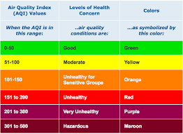
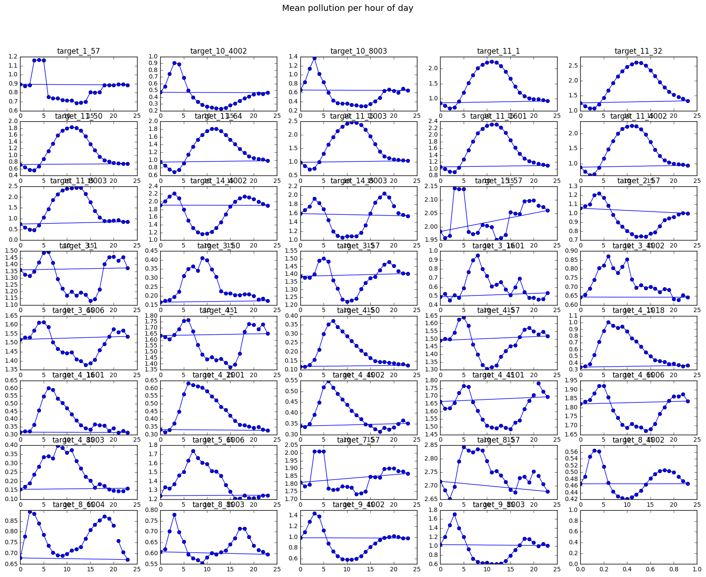
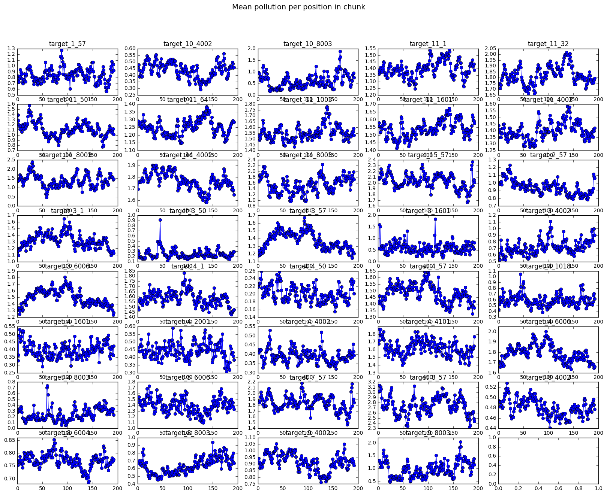
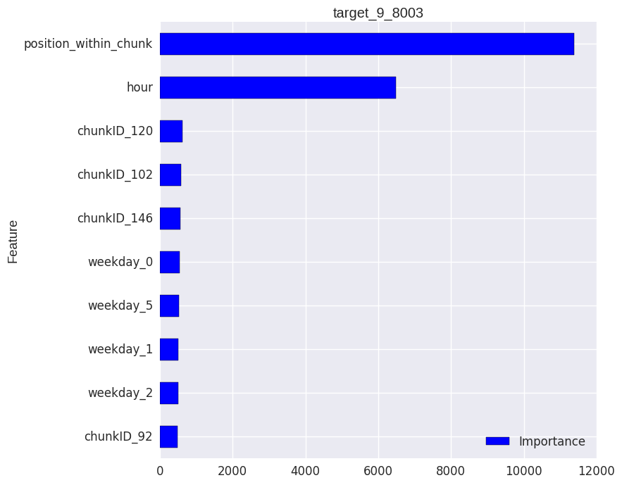
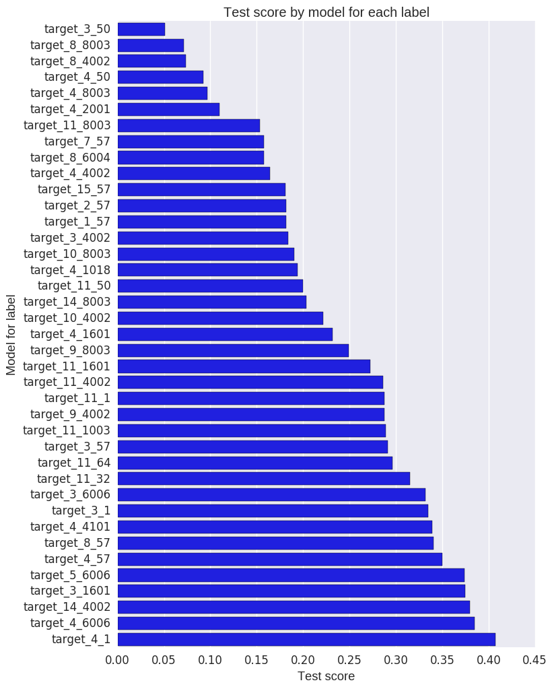

## Machine Learning Engineer Nanodegree - Capstone Project
Ger Inberg
May 5th, 2017

## I. Definition

### Project Overview

While travelling in South East Asia, I noticed the air quality issues in some bigger cities. It affects peoples lives directly because they might get breathing problems, will stay only inside buildings and/or are wearing masks. When people will know that at a certain time the air quality is bad, they can take measures to prevent possible (health) problems. Because I am curious about the current air quality prediction systems and if it can be improved I have chosen this as my subject.

In the "Human Health Effects on Air Pollution" study [@HealthEffects] the relation between air quality and the health of the people having to deal with that air have been shown. This has led to the introduction of the [@AirQualityIndex]. The AQI is an index for reporting daily air quality. It tells how clean or polluted the air is, and what might be the associated health effects. 



The EPA’s Air Quality Index is used daily by people suffering from asthma and other respiratory diseases to avoid dangerous levels of outdoor air pollutants, which can trigger attacks. There are already some systems that can predict air quality, however I would like to see if a more accurate model can be build.

The model I build could be used as the basis for an early warning system that is capable of accurately predicting dangerous levels of air pollutants on an hourly basis.
In the Air Quality Prediction Kaggle competition [@AirQualityHackathlon] this has been done already. However since this competition is already 5 years old, I want to use new techniques (for example XGBoost) to see if I can improve upon this.

### Problem Statement

Certain health problems are related to the air quality index. In order to prevent health issues due to bad air quality it is important to have an accurate estimate of it. When dangerous levels are reached, certain preventive measures can be taken, like to stay inside in the house. 

The best solution would be to make the air cleaner for example by less pollution. However that is not a solution that can be reached within in short time frame. But what we can do is to create awareness about the air quality and to signal when the level gets dangerous. People can act upon this signal by taking preventive measures and so some health problems can be prevented.

The training data that I will use to predict the air quality levels, consists of weather and time related data. Regarding weather, there is data available about temperature, wind speed/direction, pressure and solar radiation. Time data consists of featurs like hour of day, weekday and period of year. For every pollutant in the data, the air quality level is expressed by a number, where a higher number means more pollution / worse air quality. In the data exploration section, I will have a detailed analysis of the training data.

The algorithm has to predict the numeric value of the air quality for each pollutant. This is called a regression task.
There are multiple machine learning algorithms that can solve a regression task. The eXtreme Gradient Boosting (xgboost) is nowadays a very popular algorithm and wins many competitions on Kaggle [@XGBoostWinningSolutions].
Therefore I will be using xgboost in my approach to predict the airquality levels.

### Metrics

To measure the performance of a regression model, multiple metrics can be used, such as Root Mean Squared Error (RMSE) and the Mean Absolute Error (MAE).

The MAE is a quantity used to measure how close forecasts or predictions are to the eventual outcomes. It is defined by the average of the absolute differences. 
The RMSE also takes into account the difference between predictions and eventual outcomes, however it severely punishes large errors.
The metrics can be calculated in R as follow:

```{r, eval=FALSE}
MAE <- sum(abs(y-y_pred)) / length(y)
RMSE <- sqrt(mean((y-y_pred)^2))
```

To determine which metric to use, it is important to think about what a good model is.
First, a good model should have predictions that are close to the eventual outcomes. Second, it should take into account the distance between the predicted values and the outcomes.
Both of these metrics do this. 
If we have 2 predictions and the 2nd one is twice as big as the first one, the contribution of the 2nd one to MAE is just twice as big as the first one. For RMSE, the contribution of the 2nd forecast will be four time as much as the 1st forecast, because of the square.
It is not needed to severly punish for large errors, that's why I will use the MAE.

## II. Analysis

### Data Exploration

The datasets that I will use are provided by Kaggle, a description of the data can be found on [their data page] (https://www.kaggle.com/c/dsg-hackathon/data).
The datasets consists of SiteLocation data, TrainingData and a sample submission file. The sample submission file contains the test data.

The training data consists of 37821 rows while the test data consists of 2100 rows. So, the test data is only about 5.5% of the training data, which means there is relatively a large amount of training data.

The training data consists of the following features:

* rowID
* chunkID
* position_within_chunk (starts at 1 for each chunk of data, increments by hour)
* month_most_common (most common month within chunk of data--a number from 1 to 12) weekday (day of the week, as a string)
* hour (a number from 0 to 23, local time)
* Solar.radiation_64 
* WindDirection..Resultant_1 (direction the wind is blowing from given as an angle, e.g. a wind from the east is "90")
* WindDirection..Resultant_1018 (direction the wind is blowing from given as an angle, e.g. a wind from the east is "90")
* WindSpeed..Resultant_1 ("1" is site number)
* WindSpeed..Resultant_1018 ("1018" is site number)
* Ambient.Max.Temperature_(site number)
* Ambient.Min.Temperature_(site number)
* Sample.Baro.Pressure_(site number)
* Sample.Max.Baro.Pressure_(site number)
* Sample.Min.Baro.Pressure_(site number)
* (39 response variables of the form): target_(target number)_(site number) 

The definition of the response variables:  

* Target_1    EC CSN PM2.5 LC TOT
* Target_2    Total Nitrate PM2.5 LC 
* Target_3    SO2 max 5-min avg 
* Target_4    Sulfur dioxide
* Target_5    PM10 Total 0-10um STP    
* Target_7    Total Carbon PM2.5 LC TOT 
* Target_8    Sulfate PM2.5 LC 
* Target_9    Oxides of nitrogen (NOx) 
* Target_10   Nitric oxide (NO)
* Target_11   Ozone
* Target_14   Nitrogen dioxide (NO2)
* Target_15   OC CSN Unadjusted PM2.5 LC TOT

As can be seen, there are 39 output/response variables that have to be predicted. The other features are input features.
However the testing dataset only contains the first 5 features, so only these features should be used in training the algorithm. It doesn't make sense to use the other input features since, they cannot be used when evaluating the algorithm. These 5 features (rowId, chunkID, position_within_chunk, month_most_common and hour) are all categorical features.

These datasets are relevant since they contain hourly data about locations and of various quantities including pollutants. With these features a model can be created that predicts the airquality for a given location and time of day. With this prediction, it can be determined if the level is dangerous or not (and thus if a warning should be triggered).

### Exploratory Visualization

Since the test data contains only the first 5 features, I have decided to focus on the relation between these features and the targets. There are many observations in the data, so just plotting the feature data against the targets will probably not give a plot that gives much insight. However each feature contains less unique values, so if we group by a feature and average the targets, there will be less datapoints. For example, there are many chunks and most of them have common 'hour' values since hour ranges from 0-23.

When looking at the plot between hour and targets, there seems to be repetitive pattern (sinus function) for most targets. I would also expect this, since at certain times of the day there is more traffic and factories might produce more pollution which affects certain pollutants. 




Below the plot is drawn between position_in_chunk and targets, there also seems to be some kind of relation for most targets. 



I have also made these plots for the other features (see notebook), however there didn't seem to be a relation between those features and targets.

### Algorithms and Techniques

As mentioned in my proposal I will use the eXtreme Gradient Boosting (XGBoost) library to create a model for my predictions. XGBoost is a very popular library that is used successfully in a lot of Kaggle competitions.
The reasons why I want to use it for this project:

* it is fast, because it automatically parallels execution of the code
* it is accurate
* it can be used for a regression problem
* it has advanced features to tweak a model and get a better score

Now, I will explain how the algorithm is working. I have used [@XGBoost] and [@IntroXGboost] as my sources.
XGBoost can be used to solve **supervised learning** problems. In this kind of problems, there is a dataset available which has input as well as output variables. The algorithm uses this data to train a model. The model predicts the output based on the input variables.

A model is basically a mathematical function that maps inputs to outputs. A model can have parameters that determine the strength of the relation between a certain input and output. These are given in a mathematican function as coefficients. For an optimal model, one that makes the best predictions, we need to find the best parameters. 

To achieve this, an objective function can be used. An objective function measures how good a certain set of parameters is. It consists of two parts: training loss and regularization. 
The training loss specifies how good the model predicts the real outputs based on the training data. It is measured by a certain metric, like MAE or RMSE (see Metrics section). 
Regularization measures the complexity of a model. It is important that the model is not too complex, since this usually is an indication of **overfitting**. Overfitting is the term used, when a model is too specific for the training data, ie it performs very good on the training data, but less good on future data.
In short, we want to have a model which is very good in predicting without being it too complex.

XGBoosts is based on the principle of tree ensembles. This means that it uses multiple trees to determine the best parameters.
In a tree, there are branches and leaves, where the leaves can be seen as endpoints. The branches start at a decision point, based on the value of a feature, you go either left or right in the tree. In the image below, a tree is displayed to determine if someone likes computer games, based on input age, gender and occupation.


Because a single tree is mostly not strong enough, the predictions of multiple trees are combined. This is called a tree ensemble model. 
But how to determine what trees to create?
Therefore an objective function is used. This function takes into account the training loss and regularization. Mathematically it can be written as follow, where the loss is given by a function 'l' and the regularization by omega. 

$$
\begin{split}\text{obj} = \sum_{i=1}^n l(y_i, \hat{y}_i^{(t)}) + \sum_{i=1}^t\Omega(f_i) \\
\end{split}
$$
For a given tree, we also need to know how good it is. The next equation can be used to determine the objective score. T is the number of leaves, G is the sum of the first order of the loss function and H is the sum of the second order of the loss function.

$$
\begin{split}
g_i = \partial_{\hat{y}_i^{(t-1)}} l(y_i, \hat{y}_i^{(t-1)})\\
h_i = \partial_{\hat{y}_i^{(t-1)}}^2 l(y_i, \hat{y}_i^{(t-1)})\\
G_j = \sum_{i\in I_j} g_i\\
H_j = \sum_{i\in I_j} h_i\\
\text{obj}^\ast = -\frac{1}{2} \sum_{j=1}^T \frac{G_j^2}{H_j+\lambda} + \gamma T
\end{split}
$$
The smaller the objective score is, the better the structure of the tree. So, if we have a couple of trees, the scores can be calculated and compared in order to find the best tree. The image below indicates how the calculation of the objective score works.


So, with this formula we can compare between trees. But we can create a lot of trees and to compare them all is a very time consuming process. Therefore, the algorithm use the concept of information gain (or just gain). Basically this means, how much do we win or lose by extending the tree. Only if there is a positive gain, the tree should be extended. The formula below can be used to calculate the gain. The first part is the score of the new left leaf, the second part is the score on the new right leaf and the third part is the score on the original leaf. Gamma is the cost of adding an extra leaf to the model. So the gain is only positive if the extra value (gain) for this extra layer is greater than the cost.

$$
Gain = \frac{1}{2} \left[\frac{G_L^2}{H_L+\lambda}+\frac{G_R^2}{H_R+\lambda}-\frac{(G_L+G_R)^2}{H_L+H_R+\lambda}\right] - \gamma
$$
The algorithm starts from a tree with depth 0 and it will add splits, based on the gain.

Furthermore, XGBoost requires that the input data is all numeric. Therefore, some preprocessing needs to be done, which I will disucss in Data Preprocessing.

### Benchmark

Each kaggle competition contains a leaderbord with scores of the participants. Next to these scores, some benchamrk scores are provided. For this competition the next benchmarks and scores are provided

* predicting using average by hour over chunk (0.27532)
* predict using hourly averages               (0.29362)
* SubmissionZerosExceptNAs.csv                (0.53541)
* SubmissionAllZerosEvenNAsVeryBadScore.csv   (517253.56661)

Because the score is the Mean Absolute Error (MAE), obviously a lower score is better.
The last 2 benchmarks are clearly too simple (given their name) so it's not a serious benchmark to consider. The first one seems of a moderate complexity given it's name and it's position on the leaderboard. Therefore I will use this as my reference model.

## III. Methodology

### Data Preprocessing

Some features needed preprocessing in order for XGboost to process them. 

The target features contain numeric values but also some NA values. Since we can't train the model on a NA value, I decided to remove this row from the dataset.
The weekday feature contains character data, that XGBoost cannot handle. Therefore I have transformed this feature to numeric values where a Monday is a 0, Tuesday a 1, etc.

Categorical features should be transformed as well. The chunkID and month_most_common are definitely categorical in my opinion since there is no relation between the values in each of these features.

For the weekday, hour and position_within_chunk it is less easy to determine if these should be treated as categorical or not. For example: if there is a lot of pollution on Monday, does it influence the pollution on the next day(s)?
For hour and position_within_chunk I said in the section Exploratory Visualization that there seems to be a relation between the feature and the targets. So, if these features are transformed with one-hot encoding, the relation between the values is lost. Therefore I decided to treat hour and position_within_chunk as numeric features. Because the weekday didn't seem to have a relation with the targets, I treated it as a categorical feature. 

### Implementation

The first issue I stumbled upon is that XGBoost cannot handle multiple labels. Since there are 39 targets to be predicted, I had to find some other way in order to be be able this algorithm.
The second issue was that I could not compute a test score anymore on the Kaggle website, since the competition is already closed for a while.

To tackle these issues, I decided to create a model for each target feature, so 39 models. Each model uses the TrainingData dataset and splits this up in a training and test test.
In this way, the testing score can be calculated for each model. The final testing score can be determined by averaging the test scores of all models.
This approach has the disadvantage that is costs more CPU time, but because XGBoost is fast, it should still be possible to get results within a reasonable amount of time.

The steps that I am performing to train the data and calculate the testing score

* create a list of labels. For each label the next steps are done:

* split all the data in X (features) and y (label)
* remove all rows with NA for the label
* split the remaining data in train and test set

* one hot encoding categorical features in training data
* create XGB model 
* fit the XGB model on the training data

* one hot encoding categorical features in testing data
* calculate testing score

* calculate final testing score by avering testing score of all models

### Refinement

XGBoost has quite some parameters that can be used to improve the score. This website [@TuningXGBoost] has been really helpful to me in understanding how to improve the model.

I experimented with 2 parameters to see if I could improve the testing score. For the **max_depth** I have used the values 1, 3 and 5, whereas 1 is a very simple model and the higher the value, the more complex the model. I am expecting that a higher value increases the score, since a value of 1 is probably too simple.

For the **num_boosting_rounds** I have used the values 100, 500 and 1000. This parameter indicates how many rounds the algorithm will run (and boost the previous result). 

In the table below the results can be found for the 9 experiments. As I expected, the score improves when the max_depth and number of boosting rounds increases. In the next section I will elaborate more on the results.

```{r xtable, results = 'asis', echo = FALSE}
library(xtable)

df <- data.frame(eta = numeric(9), seed = numeric(9), subsample = numeric(9), colsample = numeric(9), min_child_weight = numeric(9), objective = character(9), metric = character(9),
                 max_depth = numeric(9), rounds = numeric(9), score = numeric(9))
# all the same
df[,"eta"] <- 0.1
df[,"seed"] <- 21
df[,"subsample"] <- 0.8
df[,"colsample"] <- 0.8
df[,"min_child_weight"] <- 1
df[,"objective"] <- 'reg:linear'
df[,"metric"] <- 'mae'

rounds <- list(100, 500, 1000)
depths <- list(1, 3, 5)
scores <- list(0.5602, 0.4677, 0.4002, 0.5228, 0.3645,  0.2777, 0.5246, 0.3326, 0.2386)

count <- 1
for (round in rounds){
  for (depth in depths){
    df[count, c("max_depth", "rounds", "score")] <- c(depth, round, scores[[count]])    
    count <- count + 1
  }
}
print(xtable(df, type = "latex", digits=c(0,1,0,1,1,0,0,0,0,0,4)), comment=FALSE, include.rownames=FALSE)
```


## IV. Results

### Model Evaluation and Validation

I have run my code multiple times to see if the scores were stable. In the final model these parameters are used:

* eta (learning rate): 0.1
* seed (the random number seed): 21
* subsample : 0.0
* colsample_bytree : 0.0
* min_child_weight : 1
* objective : reg:linear
* eval_metric : mae
* max_depth : 5
* num_boosting_rounds : 1000

It turned out that the test score for this configuration is close to 0.24 all the time,  so it's quite stable. This is caused by 2 factors. 
Firstly, I am using the train_test split procedure of sklearn to split the data in a training and a test set. These sets however are randomized, so each time this returns a different dataset for training and testing. This means that the training and testing is done on a different set each time. So if the model is only performing well on part of the dataset, I would expect the scores to change drastically each time.
Secondly, there are 39 models and the final score is calculated by taking the average of these models. So by averaging these results, the model will be more generally applicable. 

### Justification

My final result test score is 0.2382, which is better than then the benchmark score of 0.2753. The improvement is about 13.5 %.
Since the score is better, the predictions are closer to the real values. This means that the foundation for an early warning system is improved and a more accurate warning can be given. 

## V. Conclusion

### Free-Form Visualization

I have created a couple of plots from my final model. Since there are 2 that are both interesting I choose to add them both.
The first one (figure 6) visualizes the feature importances for the last model ordered in descending order. The position_within_chunk is the most important feature followed by hour and then some chunkID's and weekdays.
It is quite surprising to me that the position_within_chunk is more important than hour.



The second one (figure 7) gives the test scores for each model in ascending order. Thus the model with the best score is the model related to 'target_3_50'.
One can see that the range of scores is quite large, ranging from 0.05 to 0.40.



### Reflection

It took me quite a while to find a subject for this project. Since there are so many different domains where machine learning can be applied and I have a broad interest. However, I started thinking about air pollution when I was travelling in SE Asia and noticed it myself. When I saw that people are wearing masks and I read about health issues related to the air pollution, I realized it is a big problem in certain areas.
I found out there has been a Kaggle competition related to it, which was very helpful. The capstone project was quite overwhelming at first, because you have to do a lot more than in the other projects of the Nanodegree. Being able to use the Kaggle project was a big help, since I could use the dataset and there was some sample code to get started. 
Since I noticed the popularity of XGBoost, I decided that I wanted to use this algorithm. Since it is good to gain knowledge of such a popular algorithm and I wanted to see myself how it performs.

I found out that XGBoost does not support multi label classification at the moment. So, my biggest struggle has been to find out how to solve this. When doing an online search, I found out that more people have run into this and some just created a model for each label. So, I decided to follow this approach as well.
Another issue was that the testing score could not be calculated anymore on Kaggle. I could have used the training score as well since there is a public and a private leaderbord where the public one contains the training scores.
However, since the dataset is quite big, I decided to use part of the training set as test data.

The most interesting things I have learned about this project are about the algorithm and the most important features relating to the labels.
XGBoost is really fast, it's very convenient that it uses multiple cores by default so you don't have to think about that yourself. Furthermore, it gives a good score out of the box, so wiithout having to put a lot of effort in parameter tuning. I am definitely planning to use this algorithm more often!

### Improvement

I haven't used gridSearch to find the optimal parameters. I tried it, but it took a long time to calculate it even for 1 model, let alone for 39 models. Luckily the score was already quite good, by tuning some parameters myself such as the number of boosting rounds. However, I am quite sure a gridSearch to find the optimal parameters will deliver an even improved score.

I am not sure if the XGBoost approach I have followed for multi label regression is the most efficient. I have found a way that is working for this dataset and the result is good, but I didn't have the time to look if this is the most optimal approach. It would be worth to investigate if there is a way to do multi label regression with less computation time and/or less manual code.

### References
