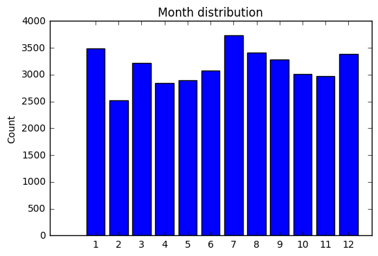

## Machine Learning Engineer Nanodegree - Capstone Project
Ger Inberg
April 25th, 2017

## I. Definition

### Project Overview

While travelling in South East Asia, I noticed the air quality issues in some bigger cities. It affects peoples lives directly because they might get breathing problems, will stay only inside buildings and/or are wearing masks. When people will know that at a certain time the air quality is bad, they can take measures to prevent possible (health) problems. Because I am curious about the current air quality prediction systems and if it can be improved I have chosen this as my subject.

In the "Human Health Effects on Air Pollution" study [@HealthEffects] the relation between air quality and the health of the people having to deal with that air have been shown. This has led to the introduction of the [@AirQualityIndex]. The AQI is an index for reporting daily air quality. It tells how clean or polluted the air is, and what might be the associated health effects. 


The EPA’s Air Quality Index is used daily by people suffering from asthma and other respiratory diseases to avoid dangerous levels of outdoor air pollutants, which can trigger attacks. There are already some systems that can predict air quality, however I would like to see if a more accurate model can be build.

The model I build could be used as the basis for an early warning system that is capable of accurately predicting dangerous levels of air pollutants on an hourly basis.
In the Air Quality Prediction Kaggle competition [@AirQualityHackathlon] this has been done already. However since this competition is already 5 years old, I want to use new techniques (for example XGBoost) to see if I can improve upon this.

### Problem Statement

Certain health problems are related to the air quality index. In order to prevent health issues due to bad air quality it is important to have an accurate estimate of it. When dangerous levels are reached, certain preventive measures can be taken, like to stay inside in the house. 

The best solution would be to make the air cleaner for example by less pollution. However that is not a solution that can be reached within in short time frame. However what we can do is to create awareness about the air quality and to signal when the level gets dangerous. People can act upon this signal by taking preventive measures and so some health problems can be prevented.

For every pollutant in the training data (see next section), the air quality level is expressed by a number, where a higher number means more pollution / worse air quality.
The algorithm has to predict the numeric value of the air quality for each pollutant. Thefore the algorithm has to solve a regression task.

There are multiple machine learning algorithms that can solve a regression task. The eXtreme Gradient Boosting (xgboost) is nowadays a very popular algorithm and wins many competitions on Kaggle [@XGBoostWinningSolutions].
Therefore I will be using xgboost.

### Metrics

To measure the performance of a regression model, multiple metrics can be used, such as Root Mean Squared Error (RMSE) and the Mean Absolute Error (MAE).

The MAE is a quantity used to measure how close forecasts or predictions are to the eventual outcomes. It is defined by the average of the absolute differences. 
The RMSE also takes into account the difference between predictions and eventual outcomes, however it severely punishes large errors.
The metrics can be calculated in R as follow:

```{r, eval=FALSE}
MAE <- sum(abs(y-y_pred)) / length(y)
RMSE <- sqrt(mean((y-y_pred)^2))
```

To determine which metric to use, it is important to think about what a good model is.
First, a good model should have predictions that are close to the eventual outcomes. Second, it should take into account the distance between the predicted values and the outcomes.
Both of these metrics do this. 
If we have 2 predictions and the 2nd one is twice as big as the first one, the contribution of the 2nd one to MAE is just twice as big as the first one. For RMSE, the contribution of the 2nd forecast will be four time as much as the 1st forecast, because of the square.
It is not needed to severly punish for large errors, that's why I will use the MAE.

## II. Analysis

### Data Exploration
In this section, you will be expected to analyze the data you are using for the problem. This data can either be in the form of a dataset (or datasets), input data (or input files), or even an environment. The type of data should be thoroughly described and, if possible, have basic statistics and information presented (such as discussion of input features or defining characteristics about the input or environment). Any abnormalities or interesting qualities about the data that may need to be addressed have been identified (such as features that need to be transformed or the possibility of outliers). Questions to ask yourself when writing this section:
- _If a dataset is present for this problem, have you thoroughly discussed certain features about the dataset? Has a data sample been provided to the reader?_
- _If a dataset is present for this problem, are statistics about the dataset calculated and reported? Have any relevant results from this calculation been discussed?_
- _If a dataset is **not** present for this problem, has discussion been made about the input space or input data for your problem?_
- _Are there any abnormalities or characteristics about the input space or dataset that need to be addressed? (categorical variables, missing values, outliers, etc.)_

The datasets that I will use are provided by Kaggle, a description of the data can be found on [their data page] (https://www.kaggle.com/c/dsg-hackathon/data).
The datasets consists of SiteLocation data, TrainingData and a sample submission file. The sample submission file contains the test data.

The training data consists of 37821 rows while the test data consists of 2100 rows. So, the test data is only about 5.5% of the training data, which means there is relatively a large amount of training data.

The training data consists of the following features:

* rowID
* chunkID
* position_within_chunk (starts at 1 for each chunk of data, increments by hour)
* month_most_common (most common month within chunk of data--a number from 1 to 12) weekday (day of the week, as a string)
* hour (a number from 0 to 23, local time)
* Solar.radiation_64 
* WindDirection..Resultant_1 (direction the wind is blowing from given as an angle, e.g. a wind from the east is "90")
* WindDirection..Resultant_1018 (direction the wind is blowing from given as an angle, e.g. a wind from the east is "90")
* WindSpeed..Resultant_1 ("1" is site number)
* WindSpeed..Resultant_1018 ("1018" is site number)
* Ambient.Max.Temperature_(site number)
* Ambient.Min.Temperature_(site number)
* Sample.Baro.Pressure_(site number)
* Sample.Max.Baro.Pressure_(site number)
* Sample.Min.Baro.Pressure_(site number)
* (39 response variables of the form): target_(target number)_(site number) 
    
As can be seen, there are 39 output/response variables that have to be predicted. The other features are input features.
However the testing dataset only contains the first 5 features, so only these features should be used in training the algorithm. It doesn't make sense to use the other input features since, they cannot be used when evaluating the algorithm. These 5 features (rowId, chunkID, position_within_chunk, month_most_common and hour) are all categorical features.

These datasets are relevant since they contain hourly data about locations and of various quantities including pollutants. With these features a model can be created that predicts the airquality for a given location and time of day. With this prediction, it can be determined if the level is dangerous or not (and thus if a warning should be triggered).

### Exploratory Visualization
In this section, you will need to provide some form of visualization that summarizes or extracts a relevant characteristic or feature about the data. The visualization should adequately support the data being used. Discuss why this visualization was chosen and how it is relevant. Questions to ask yourself when writing this section:
- _Have you visualized a relevant characteristic or feature about the dataset or input data?_
- _Is the visualization thoroughly analyzed and discussed?_
- _If a plot is provided, are the axes, title, and datum clearly defined?_



### Algorithms and Techniques
In this section, you will need to discuss the algorithms and techniques you intend to use for solving the problem. You should justify the use of each one based on the characteristics of the problem and the problem domain. Questions to ask yourself when writing this section:
- _Are the algorithms you will use, including any default variables/parameters in the project clearly defined?_
- _Are the techniques to be used thoroughly discussed and justified?_
- _Is it made clear how the input data or datasets will be handled by the algorithms and techniques chosen?_

### Benchmark
In this section, you will need to provide a clearly defined benchmark result or threshold for comparing across performances obtained by your solution. The reasoning behind the benchmark (in the case where it is not an established result) should be discussed. Questions to ask yourself when writing this section:
- _Has some result or value been provided that acts as a benchmark for measuring performance?_
- _Is it clear how this result or value was obtained (whether by data or by hypothesis)?_


## III. Methodology
_(approx. 3-5 pages)_

### Data Preprocessing
In this section, all of your preprocessing steps will need to be clearly documented, if any were necessary. From the previous section, any of the abnormalities or characteristics that you identified about the dataset will be addressed and corrected here. Questions to ask yourself when writing this section:
- _If the algorithms chosen require preprocessing steps like feature selection or feature transformations, have they been properly documented?_
- _Based on the **Data Exploration** section, if there were abnormalities or characteristics that needed to be addressed, have they been properly corrected?_
- _If no preprocessing is needed, has it been made clear why?_

### Implementation
In this section, the process for which metrics, algorithms, and techniques that you implemented for the given data will need to be clearly documented. It should be abundantly clear how the implementation was carried out, and discussion should be made regarding any complications that occurred during this process. Questions to ask yourself when writing this section:
- _Is it made clear how the algorithms and techniques were implemented with the given datasets or input data?_
- _Were there any complications with the original metrics or techniques that required changing prior to acquiring a solution?_
- _Was there any part of the coding process (e.g., writing complicated functions) that should be documented?_

### Refinement
In this section, you will need to discuss the process of improvement you made upon the algorithms and techniques you used in your implementation. For example, adjusting parameters for certain models to acquire improved solutions would fall under the refinement category. Your initial and final solutions should be reported, as well as any significant intermediate results as necessary. Questions to ask yourself when writing this section:
- _Has an initial solution been found and clearly reported?_
- _Is the process of improvement clearly documented, such as what techniques were used?_
- _Are intermediate and final solutions clearly reported as the process is improved?_


## IV. Results
_(approx. 2-3 pages)_

### Model Evaluation and Validation
In this section, the final model and any supporting qualities should be evaluated in detail. It should be clear how the final model was derived and why this model was chosen. In addition, some type of analysis should be used to validate the robustness of this model and its solution, such as manipulating the input data or environment to see how the model’s solution is affected (this is called sensitivity analysis). Questions to ask yourself when writing this section:
- _Is the final model reasonable and aligning with solution expectations? Are the final parameters of the model appropriate?_
- _Has the final model been tested with various inputs to evaluate whether the model generalizes well to unseen data?_
- _Is the model robust enough for the problem? Do small perturbations (changes) in training data or the input space greatly affect the results?_
- _Can results found from the model be trusted?_

### Justification
In this section, your model’s final solution and its results should be compared to the benchmark you established earlier in the project using some type of statistical analysis. You should also justify whether these results and the solution are significant enough to have solved the problem posed in the project. Questions to ask yourself when writing this section:
- _Are the final results found stronger than the benchmark result reported earlier?_
- _Have you thoroughly analyzed and discussed the final solution?_
- _Is the final solution significant enough to have solved the problem?_


## V. Conclusion
_(approx. 1-2 pages)_

### Free-Form Visualization
In this section, you will need to provide some form of visualization that emphasizes an important quality about the project. It is much more free-form, but should reasonably support a significant result or characteristic about the problem that you want to discuss. Questions to ask yourself when writing this section:
- _Have you visualized a relevant or important quality about the problem, dataset, input data, or results?_
- _Is the visualization thoroughly analyzed and discussed?_
- _If a plot is provided, are the axes, title, and datum clearly defined?_

### Reflection
In this section, you will summarize the entire end-to-end problem solution and discuss one or two particular aspects of the project you found interesting or difficult. You are expected to reflect on the project as a whole to show that you have a firm understanding of the entire process employed in your work. Questions to ask yourself when writing this section:
- _Have you thoroughly summarized the entire process you used for this project?_
- _Were there any interesting aspects of the project?_
- _Were there any difficult aspects of the project?_
- _Does the final model and solution fit your expectations for the problem, and should it be used in a general setting to solve these types of problems?_

### Improvement
In this section, you will need to provide discussion as to how one aspect of the implementation you designed could be improved. As an example, consider ways your implementation can be made more general, and what would need to be modified. You do not need to make this improvement, but the potential solutions resulting from these changes are considered and compared/contrasted to your current solution. Questions to ask yourself when writing this section:
- _Are there further improvements that could be made on the algorithms or techniques you used in this project?_
- _Were there algorithms or techniques you researched that you did not know how to implement, but would consider using if you knew how?_
- _If you used your final solution as the new benchmark, do you think an even better solution exists?_

-----------

**Before submitting, ask yourself. . .**

- Does the project report you’ve written follow a well-organized structure similar to that of the project template?
- Is each section (particularly **Analysis** and **Methodology**) written in a clear, concise and specific fashion? Are there any ambiguous terms or phrases that need clarification?
- Would the intended audience of your project be able to understand your analysis, methods, and results?
- Have you properly proof-read your project report to assure there are minimal grammatical and spelling mistakes?
- Are all the resources used for this project correctly cited and referenced?
- Is the code that implements your solution easily readable and properly commented?
- Does the code execute without error and produce results similar to those reported?